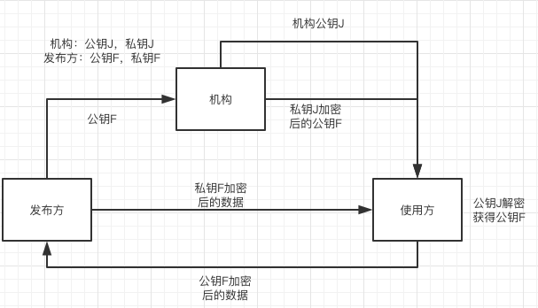
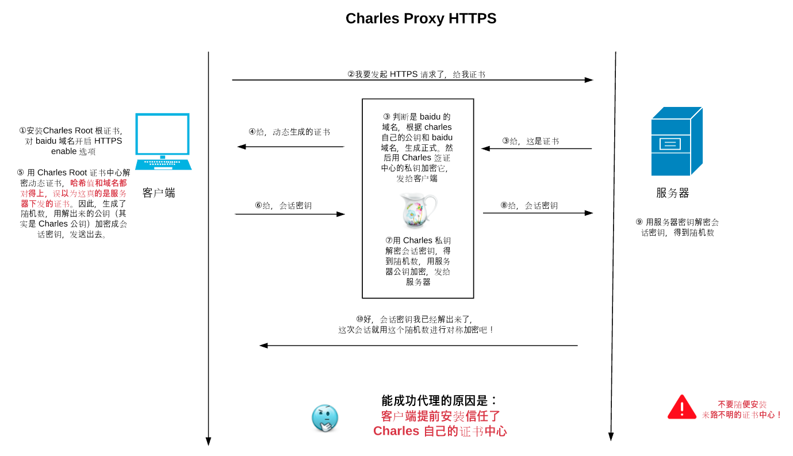

简介
`HTTP`协议全称`Hyper Text Transfer Protocol` 超文本传输协议。目前大部分服务都是基于HTTP或者HTTPS协议。这里介绍下协议中比较重要的概念。

####统一资源定位符 
`URL` `Uniform Resource Locator` 统一资源定位符。完整格式如下：
[协议类型]://访问资源需要的凭证信息@服务器地址:端口号/资源层级UNIX文件路径文件名?查询#片段`ID`
现在的`HTTP`服务一般都有独立的登陆模块，所以这里的访问资源凭证信息一般是不需要的。此外常用的服务，如HTTP，FTP等，端口号都是固定的，所以比较常用的格式如下：
[协议类型]://服务器地址/资源层级UNIX文件路径文件名?查询#片段ID。
以`http://zh.wikipedia.org:80/w/index.php?title=Special:%E9%9A%8F%E6%9C%BA%E9%A1%B5%E9%9D%A2 `为例, 其中：

1.  **http**，是协议(`protocol`)；
2.  **zh.wikipedia.org**，是服务器(`host`)；
3.  **80**，是服务器上的网络端口号(`port`)；
4.  **/w/index.php**，是路径(`path`)；
5.  **?title=Special:%E9%9A%8F%E6%9C%BA%E9%A1%B5%E9%9D%A2**，是询问(query)。

这里有一个地方需要注意，上边第5部分后面很多像乱码的东西，这是`query`部分`encoding`之后的样子。`query`里可以使用什么字符，不能使用什么字符是有约定的，那如果一定要用不能用的字符怎么办呢，很简单，`encoding`成可以用的字符就行了。服务端拿到之后，做一下`decoding`就可以用了。

`URL`使用的编码方式是百分号编码`Percent-encoding`。具体如何编码，涉及到很多规则，有兴趣的可以看下[维基百科](https://zh.wikipedia.org/wiki/%E7%99%BE%E5%88%86%E5%8F%B7%E7%BC%96%E7%A0%81)。上面的是出现在query中的字符被编码，其实，除了协议是固定的，其他可以随便定义的部分都是有可能需要编码的。并且，每个部分允许使用的字符集也不相同。所以，我们在iOS中对URL进行编码时，需要对各部分单独编码
````
let encodedHost = url.host?.addingPercentEncoding(withAllowedCharacters: .urlHostAllowed)
let encodedPath = url.path.addingPercentEncoding(withAllowedCharacters: .urlPathAllowed)
let encodedQuery = url.query?.addingPercentEncoding(withAllowedCharacters: .urlQueryAllowed)
````

#### HTTPMETHOD
`HTTP Method`一开始只有一个，后续添加到了8个
* `HTTP` 0.9 这个版本只有`GET`方法
* `HTTP` 1.0 这个版本有`GET` `HEAD` `POST`这三个方法
* `HTTP` 1.1 这个版本是当前版本，包含`GET` `HEAD` `POST` `OPTIONS` `PUT` `DELETE` `TRACE` `CONNECT` 这8个方法

这里列了8个方法，平常会用到的大概是`PUT` ，`DELETE`，`POST`，`GET`。分别对应增删改查操作。这里简单介绍一下。

**GET**方法意思是获取被请求`URI`（`Request-URI`）指定的信息（以实体的格式）。参数以`query`的形式携带。因为浏览器会对`url`的长度有限制，所以`query`的长度也会有限制，如果需要携带超过长度的参数，可以考虑使用`post`方法。

**POST** 方法被用于请求源服务器接受请求中的实体作为请求资源的一个新的从属物。参数是以`body`的形式，协议中没有指出最大长度要求。`POST`对应的是修改操作。

**PUT**方法请求服务器去把请求里的实体存储在请求`URI`（`Request-URI`）标识下。PUT 方法的语义就是让服务器用请求的主体部分来创建一个由所请求的 `URL` 命名的新文档，或者，如果那个 `URL` 已经存在的话，就用这个主体来替代它。

**DELETE** 方法，顾名思义，所做的事情就是请服务器删除请求 `URL` 所指定的资源。 

关于`HTTPMETHOD`，经常会有的问题是`GET`和`POST`的区别是什么？显而易见的是参数传递。`GET`用`query`的方式，且长度限制较多，`POST`参数放在`httpbody`中，限制较少。另外还有一个区别，理论上`GET`是幂等操作，不过多少次请求，都不会影响资源本身。但是`POST`操作会修改资源，每次操作都会造成影响，所以不是幂等的。此外，`PUT`也是幂等的，因为`PUT`理论上是覆盖操作，只要参数不变，多次覆盖和一次没有区别。

#### HTTP Header
`http header` 中规定了请求的一些限制以及额外信息。协议中注明的就有非常多，我们这里列一些比较重要的。想看全部字段，可以移步[百科](https://zh.wikipedia.org/wiki/HTTP%E5%A4%B4%E5%AD%97%E6%AE%B5])。
**Accept**能够接收的回应内容类型（`Content-Types`），例如：`Accept: text/plain`，表明希望收到的返回数据是普通文本。
**Cookie**之前由服务器通过 Set- Cookie 设置，之后请求会携带的数据，通常被服务端用来标记用户。
**Content-Type**请求体的 多媒体类型 （用于POST和PUT请求中），例如：`Content-Type: application/x-www-form-urlencoded`  。
**Host** 服务器的域名。
**Range**仅请求某个实体的一部分。字节偏移以0开始。这个字段在分片下载时非常重要。
**User-Agent**一般由请求主体设置，表明自己信息的字段。例如：`User-Agent: Mozilla/5.0 (X11; Linux x86_64; rv:12.0) Gecko/20100101 Firefox/21.0`，这里就表明了请求主体是Mozilla浏览器，并且提供了版本号等信息。

#### HTTP STATUS CODE
状态代码有三位数字组成，第一个数字定义了响应的类别，共分五种类别:
* 1xx：指示信息--表示请求已接收，继续处理
* 2xx：成功--表示请求已被成功接收、理解、接受
* 3xx：重定向--要完成请求必须进行更进一步的操作
* 4xx：客户端错误--请求有语法错误或请求无法实现
* 5xx：服务器端错误--服务器未能实现合法的请求

毕竟常见的具体类型有
200 OK                        //客户端请求成功
400 Bad Request               //客户端请求有语法错误，不能被服务器所理解
401 Unauthorized              //请求未经授权，这个状态代码必须和WWW-Authenticate报头域一起使用 
403 Forbidden                 //服务器收到请求，但是拒绝提供服务
404 Not Found                 //请求资源不存在，eg：输入了错误的URL
500 Internal Server Error     //服务器发生不可预期的错误
503 Server Unavailable        //服务器当前不能处理客户端的请求，一段时间后可能恢复正常

### HTTP的问题
* 通信使用明文，可能会被窃听
* 不验证通信方的身份
* 报文的完整性无法保证，可能被篡改

为了解决这些问题，需要在http上加入加密处理，完整性校验和认证等机制。有了这些机制，就是我们常说的HTTPS（HTTP Secure）。

### HTTPS 的实现
HTTP直接和TCP通信，HTTPS则和SSL通信，在由SSL和TCP通信。SSL是独立于HTTP的协议。

### 如何解决HTTP的问题
#### 如何对报文加密？
使用共享密钥加密，约定一个加密字符串和一个加密算法。通信双方使用同样的方式进行加密和解密。这种方式比较常见和简单，但是比较容易破解，并且加密字符串和加密算法很容易泄漏。非对称加密算法可以很好的处理这个问题，但是非对称加密算法计算量大，消耗资源和时间。对整个报文使用会造成严重的性能问题。所以将二者结合起来，先用非对称加密算法，传输共享密钥加密算法使用的密钥。然后用该密钥来加密和解密接下来要传输的报文。这样就解决了报文加密的问题。这个过程主要在https的握手过程中商定。

#### 通信方身份的验证
使用数字证书认证机构颁发的公开密钥证书。
服务端用自身的信息（域名，公司等信息）以及自己的公钥，向机构申请证书。机构使用自己的私钥对服务端的信息以及公钥进行加密，生成一个证书交给服务端。以后客户端，服务端通信的时候，服务端会将证书交给客户端，客户端使用机构的公钥对证书解密，拿到服务端信息以及服务端公钥，如果服务端信息正确无误，就可以用服务端公钥，按照上一个问题的方案进行通信。为了保证客户端的机构公钥是没有问题的，一般客户端都会内置常用的机构证书。
**备注**：公钥用于加密，可以被私钥解密。但是私钥一般用于证书签名，用公钥验证签名的合法性（通信方的身份符合）。私钥加密没有意义，因为公钥被发布出去，谁都可以下载来解密。

#### 报文完整性问题
在数据发送过程中，会带有一种叫做MAC（Message Authentication Code）的报文摘要，使用MAC来保证报文的完整性。报文的摘要会放到加密的数据中，保证摘要是服务端生成的。客户端拿到数据，解密后用同样的方式做摘要，与服务端提供的一致，就表示数据没有被改动。

#### 证书签名
我们常见的证书签名除了本文提到的https，在iOS的证书中也用到了类似的方式。这种方式用到了两对公钥私钥。既可以保证内容加密，又可以保证通信双方的合法性。
公开发布方创建公钥私钥，将公钥交给一个可信任的机构，机构使用机构私钥加密后发布出来。使用方只需要从可信任机构拿到本私钥加密后的公钥，然后用该机构的公钥进行解密，取得发布方的公钥。这样就确保了这个公钥是可以信的。然后通过该公钥与公开发布方进行数据传递。



#### Charles 抓 https 的包的原理
前提：用手机抓包，需要先安装charles的跟证书，主要用于https数据的解密
##### 步骤一
客户端发出请求，charles将请求转发给服务端，服务端会将证书交给客户端验证，charles会先拿到证书进行验证，验证之后，取出服务端公钥，**用自己的私钥封装成新的证书**，交给客户端。
##### 步骤二
客户端用安装的chales根证书验证charles传来的证书，验证无误，开始数据交换。
##### 步骤三
服务端的数据加密逻辑都被charles记录，所以可以解密数据，用来查看修改。

 


### 补充

#### http1.1 & http2.0

1. 二进制协议，不再是纯文本;
2. 可发起多个请求，废弃了 1.1 里的管道;
3. 使用专用算法压缩头部，减少数据传输量;
4. 允许服务器主动向客户端推送数据;
5. 增强了安全性，“事实上”要求加密通信。

Http3.0进入制定阶段，可能会使用chrome推的quic协议（quick udp internet connection）