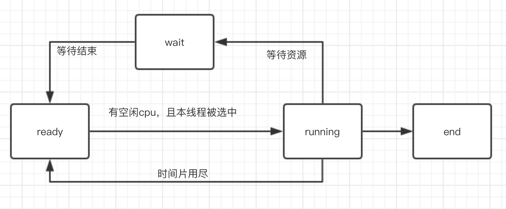

并发编程涉及到的概念：线程，队列，同步，异步，锁，临界区

### 线程

#### 简介

程序执行的最小单元，一个进程由多个线程组成，线程共享程序内存空间，以及进程资源。

线程有一些私有空间（数据不一致问题起源），栈，线程局部存储（TLS），寄存器。

用户线程和内核线程的关系

* 一对一模型
  * 有些操作系统限制内核线程数量，一对一模型会让用户线程数很受限制
  * 内核线程调度，上下文开销较大，导致用户线程执行效率低
* 多对一模型，解决了用户线程数量限制问题，以及切换开销但是由如下缺点
  * 一个用户线程阻塞，会导致内核线程阻塞，那么该内核线程对应的所有用户线程都会阻塞
* 多对多模型，解决了上边的几个问题


**问题：**

iOS，macOS 线程模型是多对多吗？

#### 调度 & 状态

线程有多个状态，ready，running，wait，end。



主流的现场调度各不相同，但是都有优先级调度以及轮转法的痕迹。轮转法就是让线程轮流执行一小段时间，而优先级调度，则决定了线程按照什么顺序轮流执行。线程从某个维度会有一些分类，比如频繁等待的线程被称为**IO密集型线程（IO Bound Thread）**，把很少等待的线程，称为**CPU密集型线程（CPU bound Thread）**。系统有时候会根据线程表现自动调节线程优先级，IO密集型线程因为经常因等待而让出CPU，所以更招系统喜爱，会调高优先级。

优先级调度下，存在一种饿死的现象。说的是一种低优先级线程，总得不到执行的情况。当一个CPU密集型线程获得较高优先级时，许多低优先级线程就可能饿死。而高优先级的IO密集型线程由于经常等待，让出cpu，所以不容易有饿死的现象。调度系统常常会提高那些等待时间较长的线程优先级，以避免饿死的情况。

**问题：**

unfair lock与线程优先级有什么关系？

线程优先级与加锁顺序的关系？

### iOS中的队列

队列分两种，串行队列，并发队列。iOS中默认有主队列，全局队列。开发者可以自己创建自己的队列。

串行队列执行完一个任务，才会执行下一个任务，串行执行。需要注意的是，串行队列只会保证串行，但是不会保证只用一个线程来执行，线程池应该是队列的下层封装，穿行队列执行完当前任务，会从线程池申请线程执行下个任务。

并发队列多个线程会依次从队列中拿出任务执行。并发数与空闲线程有关，由GCD调度。
全局队列属于并发队列，由多个线程处理任务。主队列只有主线程来执行，所以是串行队列。

**主队列一度让我很迷惑，因为它给我的感觉是，所有用户的操作都被封装成了任务，添加到主队列中执行**，比如用户点击一个按钮，打开一个页面。被封装成一个任务，放到了主队列中。这样比较好解释在主线程异步分发主队列任务`DispatchQueue.main.async`。后来有人解惑，才知道主队列不同于一般的专门的队列。主队列的实现是通过runloop来实现的，如下代码。
````objective-c
else if (msg_is_dispatch) {
    __CFRUNLOOP_IS_SERVICING_THE_MAIN_DISPATCH_QUEUE__(msg);
 } 
````
这是runloop中`CFRunLoopRunSpecific `方法中的片段。如果收到dispatch消息。就会处理主队列中的任务。主线程承担事件分发处理，额外还会处理主队列中的任务。

### 同步&异步

同步执行会阻塞当前线程，等待同步任务执行完之后继续当前线程。异步执行，相当于构造一个任务扔到队列里。不会阻塞当前线程。
异步比较简单。同步会比较难理解一点，使用场景也比较少。毕竟同步执行，不如直接执行代码块。并且有些行为也和我们理解的不太一致。比如下面这个场景。
````swift
DispatchQueue.global().sync {
    print("global sync run in main")
}
````
这段代码比较简单，我以为是用block构建一个任务放到全局队列中，然后阻塞当前线程。用global队列中的线程执行该任务。
````swift
override func viewDidLoad() {        
    super.viewDidLoad()
    DispatchQueue.global().sync {
        print("current thread = \(Thread.current)")
    }
}
//输出
current thread = <NSThread: 0x14be0d200>{number = 1, name = main}
````
这里输出的是主线程，这里的代码，和直接调用print可以说没有区别。
仔细看`sync`方法的文档，里面有这样一句话
> As an optimization, this function invokes the block on the current thread when possible.

如果可能的话，block会在当前线程中执行。上面例子中就是在当前线程中执行。下面在看个例子。
````swift
override func viewDidLoad() {
    super.viewDidLoad()
    DispatchQueue.global().async {
        print("print aaaaasync,thread: \(Thread.current)")
    }
    DispatchQueue.global().async {
        print("print aaaaasync,thread: \(Thread.current)")
    }
    DispatchQueue.global().async {
        print("print aaaaasync,thread: \(Thread.current)")
    }
    DispatchQueue.global().sync {
        print("print ssssssync,thread: \(Thread.current)")
    }
}
//输出
print ssssssync,thread: <NSThread: 0x106516640>{number = 1, name = main}
print aaaaasync,thread: <NSThread: 0x1094324e0>{number = 11, name = (null)}
print aaaaasync,thread: <NSThread: 0x10971ed40>{number = 12, name = (null)}
print aaaaasync,thread: <NSThread: 0x10971ed40>{number = 12, name = (null)}
````
这里在`sync`执行前，已经通过`async`在队列里放置了三个任务。但`sync`执行的时候，仍然是直接执行了，`async`先放进去的任务后续执行。按照队列的逻辑，这就不太说的通了，毕竟先进的还没拿出来，后进的先出了。这里猜测，可优化的情况下，sync执行的任务，根本没有放在global的queue中。而是直接在当前线程中执行了。
所以一开始给的说明要补充一点例外情况：
同步执行会阻塞当前线程，等待同步任务执行完之后继续当前线程。异步执行，相当于构造一个任务扔到队列里。不会阻塞当前线程。非主队列在主线程同步执行，会直接由主线程执行。

````swift
override func viewDidLoad() {
    super.viewDidLoad()
    let serial = DispatchQueue(label: "serial")
    serial.async {
        print("print serial async: \(Thread.current)")
    }
    serial.sync {
        print("print ssssssync,thread: \(Thread.current)")
    }
    serial.async {
        print("print serial async after: \(Thread.current)")
    }
}
//输出
print serial async: <NSThread: 0x1549134b0>{number = 10, name = (null)}
print ssssssync,thread: <NSThread: 0x14df06270>{number = 1, name = main}
print serial async after: <NSThread: 0x154913900>{number = 11, name = (null)}
````
这里的输出也很费解。按照上个结论，sync会直接在主线程执行，但是这里没有。这里是按照队列顺序执行。这个输出也说明了一个问题，队列和线程没有强绑定关系。串行队列不一定只有一个线程来执行，与当前空闲线程有关，但是会遵守串行的约定。队列应该是线程池之上的一套逻辑，队列决定哪些任务需要执行，然后将任务交给线程池，线程池决定用那个线程来处理该任务。

### 并发编程的问题

并发编程有很多好处，合理使用多核CPU，合理分配不同优先级的任务。但是并发带来的问题也很令人头疼。
线程一般不是直接操作内存中的数据，而是先读取到线程内部，然后操作，操作完写回内存。
当多个线程同时对一个变量进行操作时，就容易出现问题，
比如一个典型的问题，一百个线程，对同一个变量进行加一操作，假设原值是1，一百个线程跑完后，这个变量的值会小于100，没法准确知道会是多少。
要处理这个问题就需要做同步处理。保证读取到回写中间，不会有其他线程同时读写。

### 临界区（Critical section）

在同步的程序设计中，**临界区块**（Critical section）指的是一个访问共享资源（例如：共享设备或是共享存储器）的程序片段，而这些共享资源又无法同时被多个线程访问的特性。
对于开发来说，临界区就是一些对共享变量操作的代码块或者方法。这些方法如果同时被多个线程访问，就会出现一些不可预知的情况。如上面所说的例子，如果我们的方法是对一个共享变量做+1操作。那多个线程同时访问，是无法预知最后结果的。所以对于临界区的访问，需要用同步的方式。

### 线程同步的方式

##### `synchronized` 关键字
Objective-C使用，swift不可用。用于同步代码块，或者方法同步。多个线程会逐个进入。允许同个线程重入。
##### `objc_sync_enter` &  `objc_sync_exit`
对这两行代码中间的逻辑加同步。Swift使用，Objective-C中`synchronized `关键字依托这个实现。

##### dispatch_semaphore 信号量

信号量可以用来表示可用资源。`dispatch_semaphore_create(2); `比如这里的创建方法。要求传入一个Int值，表示创建的这个信号量表示多少资源。
每当一个资源被使用的时候，就调用`dispatch_semaphore_wait `方法，当有空闲资源时，这个方法会将资源数减一。没有空闲资源时，这个方法会阻塞当前的线程，当有空闲资源时，会继续执行。
当一个资源用完，释放时，就调用`dispatch_semaphore_signal`方法，资源数就会+1，表示多一个资源可用。

将资源数设置成1，就可以达成类似`synchronized `的效果。

##### 互斥量（Mutex）

和二元信号量很类似，资源仅同时允许一个线程访问，但和信号量不同的是，信号量在整个系统可以被任意线程获取并释放，而互斥量则要求哪个线程获取了互斥量，拿个线程负责释放，其他线程无法插手。

##### 锁
iOS关于锁有个协议
````swift
public protocol NSLocking {
    public func lock()
    public func unlock()
}
````
定义了最基本的操作，加锁和解锁，使用上类似`objc_sync_enter` &  `objc_sync_exit`，将需要同步访问的代码放到枷锁和解锁中间即可。
锁的具体实现有三个，NSLock、NSConditionLock、NSRecursiveLock。
##### NSLock
提供最基本的同步访问功能。使用比较简单
````objective-c
BOOL moreToDo = YES;
NSLock *theLock = [[NSLock alloc] init];
while (moreToDo) {
    /* Do another increment of calculation */
    /* until there’s no more to do. */
    if ([theLock tryLock]) {
        /* Update display used by all threads. */
        [theLock unlock];
    }
}
````
##### NSRecursiveLock
提供了可重入式的锁，允许同一个线程多次lock。这在递归调用上很有必要，名字也很明显，直译就叫递归锁。
````objective-c
NSRecursiveLock *theLock = [[NSRecursiveLock alloc] init];
void MyRecursiveFunction(int value)
{
    [theLock lock];
    if (value != 0)
    {
        --value;
        MyRecursiveFunction(value);
    }
    [theLock unlock];
}
MyRecursiveFunction(5);
````
##### NSConditionLock

条件锁用于处理一些有依赖的情况，例如生产者，消费者模型。
````objective-c
id condLock = [[NSConditionLock alloc] initWithCondition:NO_DATA];
while(true)
{
    [condLock lock];
    /* Add data to the queue. *///生产
    [condLock unlockWithCondition:HAS_DATA];
}
````
先无条件上锁，生产，将数据添加到队列，解锁并添加条件HAS_DATA。
````objective-c
while (true)
{
    [condLock lockWhenCondition:HAS_DATA];
    /* Remove data from the queue. */
    [condLock unlockWithCondition:(isEmpty ? NO_DATA : HAS_DATA)];
    // Process the data locally.
}
````
消费者用HAS_DATA条件解锁，如果当前的条件不是HAS_DATA，这里就会等待。生产者添加完数据，把条件设置成HAS_DATA之后，这里就会开始执行。执行完解锁，设置条件。如果还有数据，条件就是HAS_DATA，这样下个循环继续加锁，消费。如果这里数据用完了，就设置条件NO_DATA。下次循环就会等待，因为解锁的条件是HAS_DATA，不等于NO_DATA。

##### 非公平锁


##### 读写锁

对于同一个锁，读写锁有两种获取方式，**共享的（shared）**，**独占的（Exclusive）**。当锁处于自由状态，任何方式的加锁都能成功，如果锁处于共享状态，其他线程仍可以以共享的方式获取锁，但是如果有线程希望以独占的方式访问，就需要等待所有的共享锁释放。


**问题：**

条件锁是不是和信号量类似，可以由一个线程加锁，另一个线程解锁。


参考：
https://developer.apple.com/library/archive/documentation/Cocoa/Conceptual/Multithreading/ThreadSafety/ThreadSafety.html#//apple_ref/doc/uid/10000057i-CH8-SW4