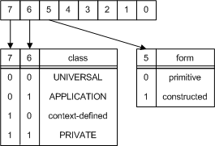
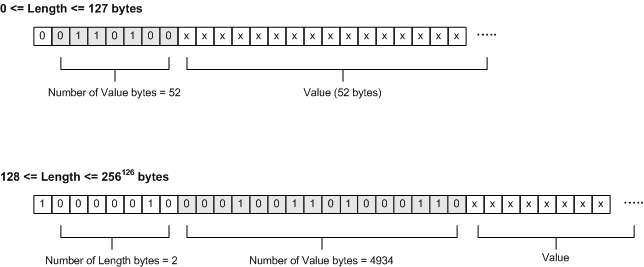

## 非对称加密算法 RSA（三位作者的名字首字母）

区别于对称加密算法，非对称加密算法采用两种密钥，公钥和私钥，公钥加密，私钥解密，反之也可以。私钥保留，公钥可以公开发布。

这种算法非常可靠，密钥越长，它就越难破解。根据已经披露的文献，目前被破解的最长RSA密钥是768个二进制位。也就是说，长度超过768位的密钥，还无法破解（至少没人公开宣布）。因此可以认为，1024位的RSA密钥基本安全，2048位的密钥极其安全。

RSA生成密钥的过程用到欧拉函数，模反元素等，十分复杂。

* 随机选择两个不相等的质数p和q
* 计算p和q的乘积n，上边说的密钥长度，就是n的长度
* 计算n的欧拉函数φ(n)
* 随机选择一个整数e，条件是1< e < φ(n)，且e与φ(n) 互质
* 计算e对于φ(n)的模反元素d

过程虽然复杂，但是一般也不需要特别清楚，我们只需知道计算过程用到了`p,q,n,e,d`，这些值封装在一起就是私钥，其中n和e封装在一起就是公钥。对计算过程感兴趣的可以看看阮一峰的博客[RSA算法原理（一）](<http://www.ruanyifeng.com/blog/2013/06/rsa_algorithm_part_one.html>)和[RSA算法原理（二）](<http://www.ruanyifeng.com/blog/2013/07/rsa_algorithm_part_two.html>)。

我们的数据，经过公钥中的n和e进行计算。计算出来的值，可以通过私钥中的n和d反解出来。

## 密钥的形式

### ASN.1

密钥中数据采用[ASN.1](https://zh.wikipedia.org/wiki/ASN.1)结构。ASN.1本身只定义了表示信息的抽象句法，但是没有限定其编码的方法。ASN.1有各种编码规则，其中密钥采用唯一编码规则（DER，Distinguished Encoding Rules）。用ASN.1表示法，公私钥大概是如下形式。

PublicKey

```
RSAPublicKey ::= SEQUENCE {
    modulus INTEGER, – n
    publicExponent INTEGER – e
}
```

PrivateKey

````
RSAPrivateKey ::= SEQUENCE {
    version           Version,
    modulus           INTEGER,  -- n
    publicExponent    INTEGER,  -- e
    privateExponent   INTEGER,  -- d
    prime1            INTEGER,  -- p
    prime2            INTEGER,  -- q
    exponent1         INTEGER,  -- d mod (p-1)
    exponent2         INTEGER,  -- d mod (q-1)
    coefficient       INTEGER,  -- (inverse of q) mod p
    otherPrimeInfos   OtherPrimeInfos OPTIONAL
}
````

### DER 编码介绍

DER编码会将数据编码成二机制形式。DER使用一种TLV格式来描述数据




如果tag是容器类型，value就是另一组TLV了




#### tag编码

tag一般占一个字节。前两位表示class类型，第三位表示原子类型还是结构体类型。





具体类型编码如下

````
0x01 == BOOLEAN
0x02 == Integer
0x03 == Bit String
0x04 == Octet String
0x05 == NULL
0x06 == Object Identifier

0x0C == UTF8String
0x13 == PrintableString
0x14 == TeletexString
0x16 == IA5String
0x1E == BMPString

0x30 == SEQUENCE or SEQUENCE OF
0x31 == SET or SET OF
````

说明：所有的这些都是UNIVERSAl类型。因为前两位都是0。1E之前的都是primitive类型，因为第三位都是0。30和31是constructed类型，第三位是1。

#### 长度的约定

长度字段标示value字段的长度。如果value字段小于128字节，长度字段占一字节。并且字节第一位是0。如果value字段多于128个字节。那这一字节的第一位设置为1，接下来的位数表示需要几个字节来表示长度字段。





说明：为什么以128为界。因为默认情况下以一个字节表达长度，而这个字节的第一位用来标志是否溢出。所以只剩下7位用来表达长度。7位可以表达的最大数字是2的7次方128。所以以128为界。如果不用第一位来标志溢出，虽然可以表达256的长度，但是超过256就无法表达了。

#### 值的约定

每个值都有一些特殊说明，全部列举比较繁杂，密钥中主要是用INTEGER类型和SEQUENCE类型，下面我们对这两种值类型进行一些说明。

##### INTEGER

正常情况指定长度中的值就是编码后的值。

比如： 0x03，编码后为 0x02 0x01 0x03。类型，长度，值，很容易理解。

但是当一个正数，并且第一位是1的时候，需要做一些标示，来表明这个值是正值。标志很简单，就是在值前面加一个全0字节。

比如值 0x8F（10001111）首位是1




0x02表明类型是INTEGER，长度两个字节，0x00表示是正数。0x8F就是这个值。

##### SEQUENCE

SEQUENCE 包含一组有序的值。超过128位的情况，按照之前的长度约定走。例子如下

````
30 81 9f                             ; SEQUENCE (9f Bytes)
|  30 0d                             ; SEQUENCE (d Bytes)
|  |  |  06 09                       ; OBJECT_ID (9 Bytes)
|  |  |  2a 86 48 86 f7 0d 01 01 01  ; 1.2.840.113549.1.1.1 
|  |  05 00                          ; NULL (0 Bytes)
|  03 81 8d                          ; BIT_STRING (8d Bytes)
|     00
|     30 81 89                       ; SEQUENCE (89 Bytes)
|        02 81 81                    ; INTEGER (81 Bytes)
|        |  00
|        |  8f e2 41 2a 08 e8 51 a8  8c b3 e8 53 e7 d5 49 50
|        |  b3 27 8a 2b cb ea b5 42  73 ea 02 57 cc 65 33 ee
|        |  88 20 61 a1 17 56 c1 24  18 e3 a8 08 d3 be d9 31
|        |  f3 37 0b 94 b8 cc 43 08  0b 70 24 f7 9c b1 8d 5d
|        |  d6 6d 82 d0 54 09 84 f8  9f 97 01 75 05 9c 89 d4
|        |  d5 c9 1e c9 13 d7 2a 6b  30 91 19 d6 d4 42 e0 c4
|        |  9d 7c 92 71 e1 b2 2f 5c  8d ee f0 f1 17 1e d2 5f
|        |  31 5b b1 9c bc 20 55 bf  3a 37 42 45 75 dc 90 65
|        02 03                       ; INTEGER (3 Bytes)
|           01 00 01
````

外层SEQUENCE，81表示接下来1个字节表示长度，接下来的字节是9f，所以这个值占9f个字节。

内层SEQUENCE，0d，表示接下来d个字节是内容。

#### 密钥的表现形式

接下来的分析，主要依据上边的编码介绍，可以对照着看。

密钥一般不是直接以der形式存在，大部分情况都会进行二次编码。比如下面这三个例子。

##### openssl生成的私钥

使用openssl生成一个私钥

```shell
openssl genrsa -out private_rsa.pem  1024
```

使用base64解码，生成一个二机制文件

```
openssl   base64  -d  -in private_rsa.pem -out private
```

可以用vim查看，

````
vi -b private
````

在vim中，将展示改成16进制`:%!xxd`

````
00000000: 3082 025d 0201 0002 8181 00cc 9cd8 3a75  0..]..........:u
00000010: 7080 3935 302a 3299 645c abbe 71b5 c3dd  p.950*2.d\..q...
00000020: 5e3e 4421 409c 29ff 58c8 ff80 b2e5 6393  ^>D!@.).X.....c.
00000030: 13fe 6576 9f7f be6b 7c3a 80f6 0645 9bfc  ..ev...k|:...E..
00000040: d878 6db5 8022 d929 2492 3f6c e69c 5603  .xm..".)$.?l..V.
00000050: 46b0 60b1 69a7 4de8 ff40 7061 dc22 b279  F.`.i.M..@pa.".y
00000060: c5b1 ccc5 d695 72cb 665f eada 0bed 9d27  ......r.f_.....'
00000070: 6e22 66e1 4d51 b3be 3393 2806 ea12 8927  n"f.MQ..3.(....'
00000080: 454c e3a4 a9ca a5b3 80c7 ad02 0301 0001  EL..............
00000090: 0281 800f 179a 9365 4a31 0b07 3350 497f  .......eJ1..3PI.
000000a0: 2af9 f2e9 0f36 1b06 5f07 34bb 472a bda6  *....6.._.4.G*..
000000b0: 4a04 3964 62cd acb4 928a f72c f2c2 d766  J.9db......,...f
000000c0: d238 f67e 2f24 3f47 3d28 54df 485e 49aa  .8.~/$?G=(T.H^I.
000000d0: 513a 4035 a265 02bd eb99 027a 214c 3a32  Q:@5.e.....z!L:2
000000e0: 343b e023 77d2 3c24 4af1 6d12 1c79 5190  4;.#w.<$J.m..yQ.
000000f0: 1cbf 73a9 32b8 e9a7 1daa 5382 2f91 7c2d  ..s.2.....S./.|-
00000100: b440 2c0d 31a4 85ee 72bb 7eae 03fb b895  .@,.1...r.~.....
00000110: e812 8102 4100 e708 c31b 59bd 52cd fe3e  ....A.....Y.R..>
00000120: 130e ec2b 0b30 b983 17d3 843b d483 ba07  ...+.0.....;....
00000130: b46a 911c 9f7e 6df5 9cdc cc04 dfe9 d5cf  .j...~m.........
00000140: 6e8e 7401 5e8d b5d4 cb41 4fa9 1093 d8c4  n.t.^....AO.....
00000150: de0d 4b1e 51b1 0241 00e2 b92a d49d 8ccf  ..K.Q..A...*....
00000160: bf3a f78e 2133 c6db bac4 6af5 4414 d514  .:..!3....j.D...
00000170: 7791 6491 b2e3 a1ca 91e1 d88f 6f1e 1f25  w.d.........o..%
00000180: d42f deb6 5b3e 85c7 b467 df10 7040 3877  ./..[>...g..p@8w
00000190: 205f 3059 c3da 6bf8 bd02 4046 9520 b65c   _0Y..k...@F. .\
000001a0: 6640 c3fa 2690 c000 5aee 2246 aacc 3eac  f@..&...Z."F..>.
000001b0: a972 b583 c212 d673 dae0 c749 64be 359e  .r.....s...Id.5.
000001c0: 86e6 b993 beb9 b1ff b2e3 663b e4f4 ebd1  ..........f;....
000001d0: 207f 960b a5a9 893a 27db 2102 4100 9527   ......:'.!.A..'
000001e0: b258 bbe9 8646 cd59 4d64 e476 3fda 281c  .X...F.YMd.v?.(.
000001f0: 218d 0f93 7aea 8a79 3a2d 10fa 4095 269a  !...z..y:-..@.&.
00000200: 5d0a 822b 85ac 896d a054 78d6 7422 686f  ]..+...m.Tx.t"ho
00000210: 6496 2479 c14d 47b2 3c6b cfc7 5695 0241  d.$y.MG.<k..V..A
00000220: 00a9 9a8c 20ac a6fb 5a17 8df8 e118 397d  .... ...Z.....9}
00000230: 22bc 706a 47cb 9d11 2f4d a4e5 708c 044d  ".pjG.../M..p..M
00000240: 1f4a 6870 3365 a8df 0c1b 440f 12c7 86de  .Jhp3e....D.....
00000250: 4246 0b99 3c9e f01f 2313 b0bf 894b aaa1  BF..<...#....K..
00000260: 58       
````

接下来比较长，比较乏味，我将生成的私钥进行了简单的格式处理，我们看看是不是符合ASN.1中对私钥的描述

````
# VERSION
0201 00 

# modulus INTEGER,  -- n
02 8181
00cc 9cd8 3a75
7080 3935 302a 3299 645c abbe 71b5 c3dd 5e3e 4421 409c 29ff 58c8 ff80 b2e5 6393
13fe 6576 9f7f be6b 7c3a 80f6 0645 9bfc d878 6db5 8022 d929 2492 3f6c e69c 5603
46b0 60b1 69a7 4de8 ff40 7061 dc22 b279 c5b1 ccc5 d695 72cb 665f eada 0bed 9d27
6e22 66e1 4d51 b3be 3393 2806 ea12 8927 454c e3a4 a9ca a5b3 80c7 ad

# publicExponent INTEGER,  -- e 65537
02 0301 0001

# privateExponent INTEGER,  -- d
0281 80
0f 179a 9365 4a31 0b07 3350 497f 2af9 f2e9 0f36 1b06 5f07 34bb 472a bda6
4a04 3964 62cd acb4 928a f72c f2c2 d766 d238 f67e 2f24 3f47 3d28 54df 485e 49aa
513a 4035 a265 02bd eb99 027a 214c 3a32 343b e023 77d2 3c24 4af1 6d12 1c79 5190
1cbf 73a9 32b8 e9a7 1daa 5382 2f91 7c2d b440 2c0d 31a4 85ee 72bb 7eae 03fb b895 e812 81

# prime1            INTEGER,  -- p
02 41
00 
e708 c31b 59bd 52cd fe3e 130e ec2b 0b30 b983 17d3 843b d483 ba07
b46a 911c 9f7e 6df5 9cdc cc04 dfe9 d5cf 6e8e 7401 5e8d b5d4 cb41 4fa9 1093 d8c4
de0d 4b1e 51b1 

# prime2            INTEGER,  -- q
0241 
00
e2 b92a d49d 8ccf bf3a f78e 2133 c6db bac4 6af5 4414 d514
7791 6491 b2e3 a1ca 91e1 d88f 6f1e 1f25 d42f deb6 5b3e 85c7 b467 df10 7040 3877
205f 3059 c3da 6bf8 bd

# exponent1         INTEGER,  -- d mod (p-1)
02 40
46 9520 b65c
6640 c3fa 2690 c000 5aee 2246 aacc 3eac a972 b583 c212 d673 dae0 c749 64be 359e
86e6 b993 beb9 b1ff b2e3 663b e4f4 ebd1 207f 960b a5a9 893a 27db 21

# exponent2         INTEGER,  -- d mod (q-1)
02 41
00 
9527 b258 bbe9 8646 cd59 4d64 e476 3fda 281c 218d 0f93 7aea 8a79 3a2d 10fa 4095 269a
5d0a 822b 85ac 896d a054 78d6 7422 686f 6496 2479 c14d 47b2 3c6b cfc7 5695 

# coefficient       INTEGER,  -- (inverse of q) mod p
0241
00
a9 9a8c 20ac a6fb 5a17 8df8 e118 397d 22bc 706a 47cb 9d11 2f4d a4e5 708c 044d
1f4a 6870 3365 a8df 0c1b 440f 12c7 86de 4246 0b99 3c9e f01f 2313 b0bf 894b aaa1 58 
````

可以看到，私钥中的数据在这里面有完整的对应。


##### 服务端给的公钥，待补充：这个公钥的类型是什么？

````
-----BEGIN PUBLIC KEY-----
MIGfMA0GCSqGSIb3DQEBAQUAA4GNADCBiQKBgQCBzf/UKYSGEZNn0ziH8ZhcSmIJ
bVIzGx95BW2URGzpuNDUbdX55mOMPO9Arw/j5zh1kPG5fVq0BcZMFkYhIOn4+6kj
awVpjnNzCvvj2//csftaKyyFslvKPf1Gu3kd/OTVKg93L0kL+SFmPtqI1RT6HUqK
4N6Ht24bia11kkgnewIDAQAB
-----END PUBLIC KEY-----
````

格式化后

````
3081 9f //9f长度的SEQUENCE数据
30 0d   //d 长度的SEQUENCE数据
06 09 2a 8648 86f7 0d01 0101 //9 长度的 Object Identifier数据 1.2.840.113549.1.1.1
0500 //结尾的NULL
0381 8d  //8d长度的 Bit String 数据
00 
3081 8902 8181 0081 cdff
d429 8486 1193 67d3 3887 f198 5c4a 6209
6d52 331b 1f79 056d 9444 6ce9 b8d0 d46d
d5f9 e663 8c3c ef40 af0f e3e7 3875 90f1
b97d 5ab4 05c6 4c16 4621 20e9 f8fb a923
6b05 698e 7373 0afb e3db ffdc b1fb 5a2b
2c85 b25b ca3d fd46 bb79 1dfc e4d5 2a0f
772f 490b f921 663e da88 d514 fa1d 4a8a
e0de 87b7 6e1b 89ad 7592 4827 7b02 0301 
00 01
````

头信息很长，首先是一个SEQUNENCE开头，里面有一个SEQUNENCE和一个Bit String。

内部的这个SEQUNENCE包装了两个数据，一个对象标识，一个空数据结尾，这个对象标识解出来是`1.2.840.113549.1.1.1`,对应的名字是`szOID_RSA_RSA`。这是加密算法标识符，有很多类型，这个类型表示，RSA既可以用于加密，也可以用于给数据签名。详细信息可以[参考](https://docs.microsoft.com/en-us/windows/desktop/api/wincrypt/ns-wincrypt-_crypt_algorithm_identifier)。

Bit String中放的数据就是我们的公钥了，下面看看这个公钥

````
30 81 89

02 81 81 
0081 cdff
d429 8486 1193 67d3 3887 f198 5c4a 6209
6d52 331b 1f79 056d 9444 6ce9 b8d0 d46d
d5f9 e663 8c3c ef40 af0f e3e7 3875 90f1
b97d 5ab4 05c6 4c16 4621 20e9 f8fb a923
6b05 698e 7373 0afb e3db ffdc b1fb 5a2b
2c85 b25b ca3d fd46 bb79 1dfc e4d5 2a0f
772f 490b f921 663e da88 d514 fa1d 4a8a
e0de 87b7 6e1b 89ad 7592 4827 7b

02 03 
01 00 01
````

以SEQUNENCE作为容器，里面有两个Integer，一个是129个字节的n，一个是e 65537。

##### sshkeygen生成的公钥

````
00000000: 0000 0007 7373 682d 7273 6100 0000 0301  ....ssh-rsa.....
00000010: 0001 0000 0101 00a0 f5d6 20a3 2ff7 6106  .......... ./.a.
00000020: d301 e98a d7a8 6307 bc30 74e8 5668 d7b0  ......c..0t.Vh..
00000030: 80a8 0f8d c1c0 c495 53f4 e016 ec17 26d1  ........S.....&.
00000040: 1635 bfe6 0a60 6174 1a9c dcef 176e 0fb7  .5...`at.....n..
00000050: bd66 a939 25ce 1a56 c446 e3c5 1c31 b894  .f.9%..V.F...1..
00000060: c17f db57 bd4e 88bc b3a8 5c95 919c 2394  ...W.N....\...#.
00000070: 39d0 254b ecac 94fb 7d69 ec1c 143a 434f  9.%K....}i...:CO
00000080: d6a8 4572 eaf6 aef3 3d5e 7899 4ba5 739d  ..Er....=^x.K.s.
00000090: 45d6 d928 b506 93fd 41ae d3f8 1149 92ac  E..(....A....I..
000000a0: f483 a853 22cc ac09 ee5f 76ff 36b6 0424  ...S"...._v.6..$
000000b0: 2dce 9ea1 be1b 92aa 73b6 f1cf 22dc f304  -.......s..."...
000000c0: e146 50ad 472d 4885 9d67 160c fac7 b2e8  .FP.G-H..g......
000000d0: 915b 925c 979f 54b3 2934 269d 28e2 e88b  .[.\..T.)4&.(...
000000e0: 202d c95c a8c8 66af 5784 6cf2 269e abc6   -.\..f.W.l.&...
000000f0: 1bf0 5531 66a4 72fc d10b 9237 00e0 9b17  ..U1f.r....7....
00000100: d2ab 7bf0 a135 0b37 d399 6731 eb83 6f2e  ..{..5.7..g1..o.
00000110: a49c 84c0 9781 63   
````

这个有点尴尬，好像不是der的编码格式。而且，第一行还显示出了ssh-rsa。这个格式没找到对应的编码介绍，网上有人翻译，看翻译过程，这个编码格式像是简化了的der。可能因为信息类型确定，长度也相对确定，所以省掉了tag，以及长度溢出的措施，这里应该是LV格式，即长度-值。长度占4个字节。我们用这个规则看一下上面的数据。

````
0000 0007 //长度 7
7373 682d 7273 61 //ascii码：ssh-rsa
0000 0003  //长度 3
010001     // e 65537
0000 0101  //长度256
//下面的256个字节，n
00 a0 f5d6 20a3 2ff7 6106
d301 e98a d7a8 6307 bc30 74e8 5668 d7b0
80a8 0f8d c1c0 c495 53f4 e016 ec17 26d1
1635 bfe6 0a60 6174 1a9c dcef 176e 0fb7
bd66 a939 25ce 1a56 c446 e3c5 1c31 b894
c17f db57 bd4e 88bc b3a8 5c95 919c 2394
39d0 254b ecac 94fb 7d69 ec1c 143a 434f
d6a8 4572 eaf6 aef3 3d5e 7899 4ba5 739d
45d6 d928 b506 93fd 41ae d3f8 1149 92ac
f483 a853 22cc ac09 ee5f 76ff 36b6 0424
2dce 9ea1 be1b 92aa 73b6 f1cf 22dc f304
e146 50ad 472d 4885 9d67 160c fac7 b2e8
915b 925c 979f 54b3 2934 269d 28e2 e88b
202d c95c a8c8 66af 5784 6cf2 269e abc6
1bf0 5531 66a4 72fc d10b 9237 00e0 9b17
d2ab 7bf0 a135 0b37 d399 6731 eb83 6f2e
a49c 84c0 9781 63
````

这个数据表达了三个信息，类型ssh-rsa，e 65537，n那一大串数。

ssh-keygen生成的公钥id_rsa.pub，可以通过命令`ssh-keygen -f key.pub -e -m pem`转成标准der格式。

比如上面那个公钥经过这个命令之后是这样的。

````
00000000: 3082 010a 0282 0101 00a0 f5d6 20a3 2ff7  0........... ./.
00000010: 6106 d301 e98a d7a8 6307 bc30 74e8 5668  a.......c..0t.Vh
00000020: d7b0 80a8 0f8d c1c0 c495 53f4 e016 ec17  ..........S.....
00000030: 26d1 1635 bfe6 0a60 6174 1a9c dcef 176e  &..5...`at.....n
00000040: 0fb7 bd66 a939 25ce 1a56 c446 e3c5 1c31  ...f.9%..V.F...1
00000050: b894 c17f db57 bd4e 88bc b3a8 5c95 919c  .....W.N....\...
00000060: 2394 39d0 254b ecac 94fb 7d69 ec1c 143a  #.9.%K....}i...:
00000070: 434f d6a8 4572 eaf6 aef3 3d5e 7899 4ba5  CO..Er....=^x.K.
00000080: 739d 45d6 d928 b506 93fd 41ae d3f8 1149  s.E..(....A....I
00000090: 92ac f483 a853 22cc ac09 ee5f 76ff 36b6  .....S"...._v.6.
000000a0: 0424 2dce 9ea1 be1b 92aa 73b6 f1cf 22dc  .$-.......s...".
000000b0: f304 e146 50ad 472d 4885 9d67 160c fac7  ...FP.G-H..g....
000000c0: b2e8 915b 925c 979f 54b3 2934 269d 28e2  ...[.\..T.)4&.(.
000000d0: e88b 202d c95c a8c8 66af 5784 6cf2 269e  .. -.\..f.W.l.&.
000000e0: abc6 1bf0 5531 66a4 72fc d10b 9237 00e0  ....U1f.r....7..
000000f0: 9b17 d2ab 7bf0 a135 0b37 d399 6731 eb83  ....{..5.7..g1..
00000100: 6f2e a49c 84c0 9781 6302 0301 0001       o.......c.....
````

这个就很熟悉了，标准的TLV格式。SEQUNENCE下两个INTEGER，n和e。

#### 待补充

密钥的格式只见到过这几种，就对这几种进行了分析。还需要看看总共有多少种，如何分类，以及为什么这么分类。


**参考**

[解读RSA公钥私钥储存格式](http://github.tiankonguse.com/blog/2017/07/01/ASN1-SRA.html)

[stackoverflow](https://stackoverflow.com/questions/12749858/rsa-public-key-format)

[CONVERTING OPENSSH PUBLIC KEYS](https://blog.oddbit.com/post/2011-05-08-converting-openssh-public-keys/)

[DER 编码](https://docs.microsoft.com/en-us/windows/desktop/seccertenroll/distinguished-encoding-rules)

[RSA 算法原理](http://www.ruanyifeng.com/blog/2013/07/rsa_algorithm_part_two.html)

[各类证书格式](https://serverfault.com/questions/9708/what-is-a-pem-file-and-how-does-it-differ-from-other-openssl-generated-key-file)