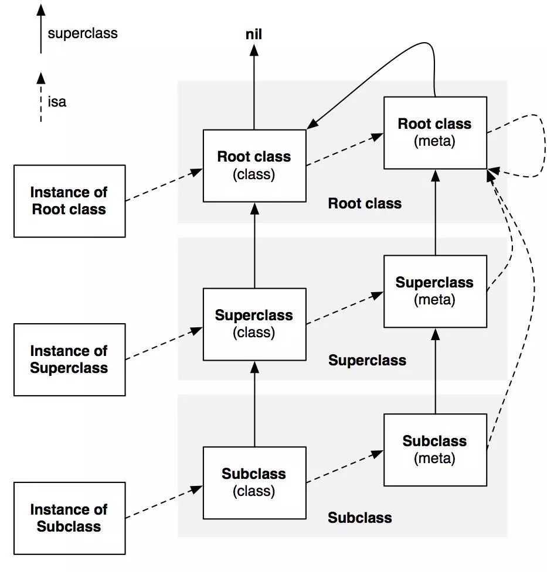

# runtime

## 简介

Runtime其实有两个版本: “modern” 和 “legacy”。我们现在用的 Objective-C 2.0 采用的是现行 (Modern) 版的 Runtime 系统，只能运行在 iOS 和 macOS 10.5 之后的 64 位程序中。而 maxOS 较老的32位程序仍采用 Objective-C 1 中的（早期）Legacy 版本的 Runtime 系统。这两个版本最大的区别在于当你更改一个类的实例变量的布局时，在早期版本中你需要重新编译它的子类，而现行版就不需要。

## 数据结构

Runtime中的数据结构，起点为`objc_object`。有种万物皆对象的感觉。`objc_object`是结构体类型，内部有一个属性，`isa_t`类型的`isa`。


关于元类的几个方法实现

````c++
//objc_class结构体中的方法
//是否是元类，存在ro中
bool isMetaClass() {
    assert(this);
    assert(isRealized());
    return data()->ro->flags & RO_META;
}

// NOT identical to this->ISA when this is a metaclass
//如果本身就是元类，就返回自己，否则取isa（指向的元类）
Class getMeta() {
    if (isMetaClass()) return (Class)this;
    else return this->ISA();
}
//superclass为nil时，自己就是跟类
bool isRootClass() {
    return superclass == nil;
}
//元类和自己一样，就是根元类
bool isRootMetaclass() {
    return ISA() == (Class)this;
}
````



几种获取class的方式区别

`object_getClass`在非taggedPointer类型中，是取的isa中的指针部分，isa是指向的元类，所以这个方法是取元类。

```c++
/***********************************************************************
* object_getClass.
* Locking: None. If you add locking, tell gdb (rdar://7516456).
**********************************************************************/
Class object_getClass(id obj)
{
    if (obj) return obj->getIsa();
    else return Nil;
}

inline Class 
objc_object::getIsa() 
{
    if (isTaggedPointer()) {
        uintptr_t slot = ((uintptr_t)this >> TAG_SLOT_SHIFT) & TAG_SLOT_MASK;
        return objc_tag_classes[slot];
    }
    return ISA();
}

inline Class 
objc_object::ISA() 
{
    assert(!isTaggedPointer()); 
    return (Class)(isa.bits & ISA_MASK);
}
```


`self.class`是NSObject提供的属性访问，根据类型不同有两种返回，类对象调用，就是返回自己，实例对象调用，就是返回元类。

```objective-c
//类调用，返回self
+ (Class)class {
    return self;
}
//实例变量
- (Class)class {
    return object_getClass(self);
}
```


## 相关应用

### KVO，KVC


### 方法转发


### 方法替换


参考：

<http://yulingtianxia.com/blog/2014/11/05/objective-c-runtime/>

