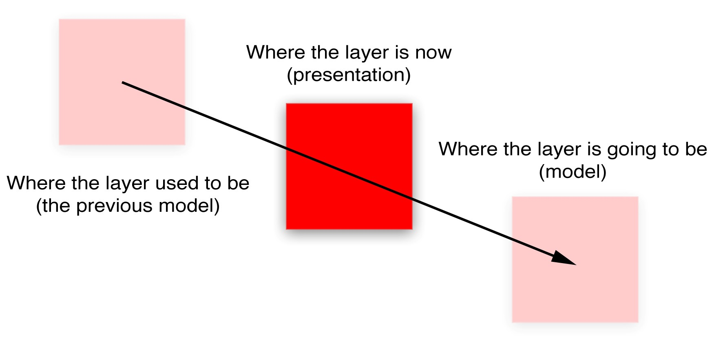

# 动画

## iOS Animation的组织结构

常用的动画类CABasicAnimation，CAKeyframeAnimation都继承自CAPropertyAnimation。CATrasition用于转场动画，CAAnimationGroup用于组织多个动画协同。

表现层（presentation）

大多数情况下，你不需要直接访问呈现图层，你可以通过和模型图层的交互，来让Core Animation更新显示。两种情况下呈现图层会变得很有用，一个是同步动画，一个是处理用户交互。

- 如果你在实现一个基于定时器的动画（见第11章“基于定时器的动画”），而不仅仅是基于事务的动画，这个时候准确地知道在某一时刻图层显示在什么位置就会对正确摆放图层很有用了。
- 如果你想让你做动画的图层响应用户输入，你可以使用`-hitTest:`方法（见第三章“图层几何学”）来判断指定图层是否被触摸，这时候对*呈现*图层而不是*模型*图层调用`-hitTest:`会显得更有意义，因为呈现图层代表了用户当前看到的图层位置，而不是当前动画结束之后的位置。

## UIView动画

## CADisplayLink

transition介绍

When you add the transition as an animation, an implicit CATransaction is begun. From that point on, all modifications to layer properties are going to be animated rather than immediately applied. The way the CATransition performs this animation to to take a snapshot of the view before the layer properties are changed, and a snapshot of what the view will look like after the layer properties are changed. It then uses a filter (on Mac this is Core Image, but on iPhone I'm guessing it's just hard-coded math) to iterate between those two images over time.

This is a key feature of Core Animation. Your draw logic doesn't generally need to deal with the animation. You're given a graphics context, you draw into it, you're done. The system handles compositing that with other images over time (or rotating it in space, or whatever). So in the case of changing the hidden state, the initial-state fully composited image is blended with the final-state composted image. Very fast on a GPU, and it doesn't really matter what change you made to the view.

<https://stackoverflow.com/questions/2233692/how-does-catransition-work>

timingFunction

问题：

layer层的动画过程中，frame不变？无法点击？

参考：

<http://liuyanwei.jumppo.com/2015/10/30/iOS-Animation-UIViewAndCoreAnimation.html>

<https://github.com/AsTryE/IOS-Teach/blob/master/1.IOS%E6%9C%80%E5%85%A8%E5%8A%A8%E7%94%BB%E6%95%99%E7%A8%8B%EF%BC%88%E5%9F%BA%E7%A1%80%EF%BC%89.md>

<https://github.com/qunten/iOS-Core-Animation-Advanced-Techniques>